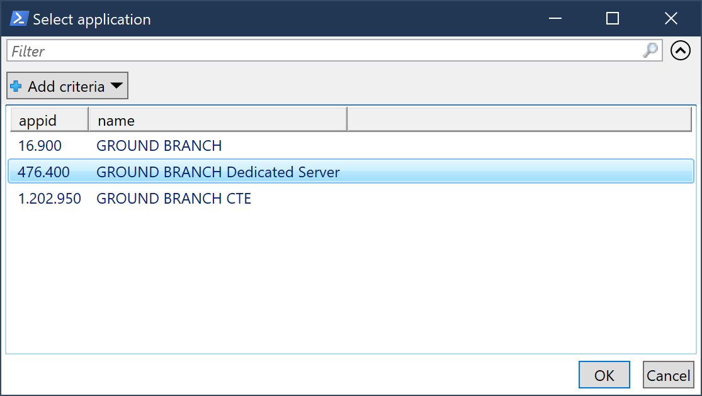

# SteamPS


| GH Actions                                                                                                                                                                                                 | Codecov                                                                                                                                 | PS Gallery                                                                                                                                                  |
| ---------------------------------------------------------------------------------------------------------------------------------------------------------------------------------------------------------- | --------------------------------------------------------------------------------------------------------------------------------------- | ----------------------------------------------------------------------------------------------------------------------------------------------------------- |
| [](https://github.com/hjorslev/SteamPS/actions/workflows/CI.yml) | [](https://app.codecov.io/gh/hjorslev/SteamPS) | [](https://www.powershellgallery.com/packages/SteamPS) |

- [SteamPS](#steamps)
  - [Introduction](#introduction)
  - [Command Reference](#command-reference)
  - [Prerequisites](#prerequisites)
  - [Getting Started](#getting-started)
    - [Install from PowerShell Gallery](#install-from-powershell-gallery)
    - [Usage](#usage)
      - [Update single app / game server](#update-single-app--game-server)
      - [Install / Update using ApplicationName](#install--update-using-applicationname)
      - [Install / Update using AppID](#install--update-using-appid)
      - [Authenticating](#authenticating)
  - [Update Steam server automatically](#update-steam-server-automatically)

## Introduction

SteamPS is a [PowerShell module](https://github.com/PowerShell/PowerShell/) that utilizes PowerShell as a wrapper for [SteamCMD](https://developer.valvesoftware.com/wiki/SteamCMD) and interacts with various [Steam APIs](https://steamcommunity.com/dev).

SteamPS is aimed at server administrators maintaining one or more servers. It can
be used to install SteamCMD, update game servers, query Steam based game servers
for server information and more.

## Command Reference

| Cmdlet                                                   | Description                                                         |
| -------------------------------------------------------- | ------------------------------------------------------------------- |
| [Connect-SteamAPI](docs/Connect-SteamAPI.md)             | Create or update the Steam Web API config file.                     |
| [Find-SteamAppID](docs/Find-SteamAppID.md)               | Find a Steam AppID by searching the name of the application.        |
| [Get-SteamFriendList](docs/Get-SteamFriendList.md)       | Returns the friend list of any Steam user.                          |
| [Get-SteamNews](docs/Get-SteamNews.md)                   | Returns the latest news of a game specified by its AppID.           |
| [Get-SteamPlayerBan](docs/Get-SteamPlayerBan.md)         | Returns Community, VAC, and Economy ban statuses for given players. |
| [Get-SteamPlayerSummary](docs/Get-SteamPlayerSummary.md) | Returns basic profile information for a list of 64-bit Steam IDs.   |
| [Get-SteamServerInfo](docs/Get-SteamServerInfo.md)       | Query a running Steam based game server.                            |
| [Install-SteamCMD](docs/Install-SteamCMD.md)             | Downloads and installs SteamCMD.                                    |
| [Resolve-VanityURL](docs/Resolve-VanityURL.md)           | Resolve a vanity URL (also named custom URL).                       |
| [Update-SteamApp](docs/Update-SteamApp.md)               | Install or update a Steam application using SteamCMD.               |
| [Update-SteamServer](docs/Update-SteamServer.md)         | Update a Steam based game server through a workflow.                |

## Prerequisites

- Windows based OS
- Windows PowerShell 5.1 / PowerShell 6+

You can find your version of PowerShell by using:

```powershell
$PSVersionTable.PSVersion
```

## Getting Started

### Install from PowerShell Gallery

The module is published in the [PowerShell Gallery](https://www.powershellgallery.com/packages/SteamPS).

Run the following in an elevated prompt to install the module globally for all
users on the server:

```powershell
Install-Module -Name SteamPS
```

The module can also be installed in the current user's scope by adding
`-Scope CurrentUser` to the above mentioned command. If multiple people are administrating
the server, it can be easier to maintain the module by having SteamPS installed in
just one location.

Furthermore, if you plan to have cmdlets from the module running unattended
you will need to make sure that the module is available to the user running it. This
can be achieved by ensuring the module is installed for the user running it, or just
have it installed globally for all users as exemplified above.

When SteamPS is installed you will need to use the cmdlet `Install-SteamCMD` from
the module to install SteamCMD. This is done by calling `Install-SteamCMD` from an
elevated prompt:

```powershell
Install-SteamCMD
```


By using the parameter `-InstallPath` you can specify an install location of SteamCMD.
The default installation path is C:\Program Files\SteamCMD. The install path,
default or custom, is added to the [PATH](<https://en.wikipedia.org/wiki/PATH_(variable)>).

### Usage

#### Update single app / game server

The cmdlet `Update-SteamApp` is used to both install and/or update an application.
You can either specify the name of the application or the application ID.

#### Install / Update using ApplicationName

If you enter e.g. _Ground Branch_ as an application name you will see
both the game itself as well as the dedicated server. You will have to select the
correct application from the popup box.

```powershell
Update-SteamApp -ApplicationName 'Ground Branch' -Path 'C:\DedicatedServers\GB'
```



You can narrow down the search by typing an application name that is more specific
than simply _Ground Branch_ e.g. _Ground Branch Dedi_ or type it out
in its entirety as _Ground Branch Dedicated Server_. This will only give one result
and not display a popup.

```powershell
Update-SteamApp -ApplicationName 'Ground Branch Dedicated Server' -Path 'C:\DedicatedServers\GB'
```


#### Install / Update using AppID

In this example we install _ARK: SurvivalEvolved Dedicated Server_ by using its
AppID. The AppID can be found by using a database such as
[Steam Database](https://steamdb.info/) or by searching for the AppID with the cmdlet
`Find-SteamAppID` e.g. `Find-SteamAppID -ApplicationName 'Counter-Strike'`.

```powershell
Update-SteamApp -AppID 376030 -Path 'C:\DedicatedServers\ARK-SurvivalEvolved'
```

#### Authenticating

The two previous examples do not require authentication to install. However, some
applications might require a Steam account. If that is the case, you will need to
use the parameter `-Credential` to authenticate:

```powershell
Update-SteamApp -ApplicationName 'Ground Branch Dedicated Server' -Path 'C:\DedicatedServers\GB' -Credential SAS_Admin
```

This will present you with an option to type in your password.

In case you need to authenticate and want to run the script unattended, avoid writing
the password in plaintext in the script. See how this can be achieved:
[Store Credentials in PowerShell Script](https://pscustomobject.github.io/powershell/howto/Store-Credentials-in-PowerShell-Script/#store-encrypted-password-in-an-external-file).

## Update Steam server automatically

The cmdlet `Update-SteamServer` is, at least for my own use case, applied to automatically
keep a server up to date. It will check if the server is empty before updating
it. The script is configured as a [Windows Task](https://o365reports.com/2019/08/02/schedule-powershell-script-task-scheduler/)
and runs very night.

Please see the wiki for further information: [Update Steam server automatically](https://github.com/hjorslev/SteamPS/wiki/Update-Steam-server-automatically).

## Acknowledgements

Joystick icon by Delapouite. Available at [game-icons.net](https://game-icons.net/1x1/delapouite/joystick.html).